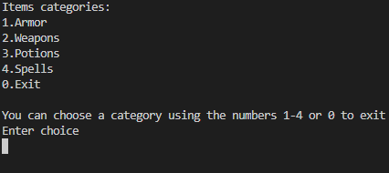
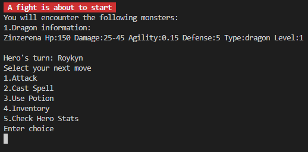

#### Eκπόνηση της εργασίας
__Όνομα__: Γεώργιος-Κωνσταντίνος Ζαχαρόπουλος

---

#### Περιεχόμενο του Project
Υλοποίηση σε C++ η προσομοίωση ενός παιχνιδιού ρόλων (role playing game). Το παιχνίδι
έχει αντικείμενα, ξόρκια, ήρωες και τέρατα. Η εργασία έγινε στο πλαίσιο του μαθήματος Κ10 Object Oriented Programming ως τελικό project.

#### Screenshots από το παιχνίδι

#### Map

  

#### Shop

   
  

#### Fight

  
  

#### Εκτέλεση προγράμματος
Για να εκτελέσετε το πρόγραμμα ανοίξτε τον φάκελο `/programs` και εκτελέστε την εντολή `make run`. Μπορείτε να τρέξετε και `make valgrind` για να ελέγξετε για leaks και `make clean` για να διαγράψετε τα εκτελέσιμα.

---

#### Aναπαράσταση Δεδομένων
Προτίμησα το Shop να είναι ενιαίο για όλα τα αντικείμενα και να μην κάνω sub shops για τα items και spells ξεχωριστά. Παρόμοια και για το Inventory.

Οπότε τόσο τα αντικείμενα του Shop όσο και του Inventory του ήρωα αποτελούνται από Useables
και μπορουμε να ξεχωρίσουμε παίρνοντας το *type* τους.

Πχ Το Useable->Item έχει type = "item" ενώ το Useable->Spell->Fire Spell έχει type = "fire_spell"

    Useables -> {Items, Spells}
    Items -> {Armor, Weapon, Potion}
    Weapon -> {One Handed, Two Handed}
    Potion -> {Health Potion, Magic Potion, Strength Potion, DexterityPotion, AgilityPotion}
    Spell -> {Fire Spell, Ice Spell, Lighting Spell}

Ολες οι οντότητες(ήρωες και τέρατα) είναι τύπου Living

    Living -> {Hero, Monster}
    Monster -> {Dragon , Exosceleton, Spirit}
    Hero -> {Warrior, Sorcerer, Paladin}

H αναπράσταση του map γίνεται μέσω του Grid που είναι ουσιαστικά ένα container από Squares και Heroes

Κάθε τετράγωνο του χάρτη είναι Square

    Square -> {Common, Shop, Unaccessible}

Έχω βάλει και σχόλια στον κώδικα όπου γινόταν σύνθετος οπότε ελπίζω να μην δυσκολευτείτε στην κατανόησή του.

----

#### Tips για το game
Θα ήταν καλό πριν ξεκινήσετε κάποια μάχη να έχετε εξοπλιστεί πρώτα από το shop. Για αυτό και έβαλα ένα shop δίπλα στο starting point. Have fun :)

----

#### Σχόλια
Tα controls του παιχνδιού εμφανίζονται όταν ξεκινήσει το παιχνίδι αλλά θα αφήσω και ένα reference παρακάτω:

Γράφετε τον χαρακτήρα που θέλετε στο terminal και πατατε enter.
* move using w-a-s-d (w=up, s=down, a=left, d=right)
* quit using q
* equip items using e
* check invetory using i
* consume potions using u
* check hero's stats using o

Τα spells ίδιου τύπου δεν κάνουν scale τα effects τους στα τέρατα, υπερισχύει πάντα το τελευταίο.

Tα τέρατα κάνουν επίθεση πάντα στον πρώτο διαθέσιμο ήρωα.

Στο προγραμμα έχω χρησιμοποιήσει συναρτήσεις `system` (`sytem("clear)`) καθώς και *colour sequences* τα οποία λειτουργούν στο περιβάλλον linux της σχολής. Αν όμως τρέξετε το πρόγραμμα σε άλλο περιβάλλον οι συμπεριφορά ειναι undefined και λογικά θα εμφανίσει garbage. Tα *colour sequences* είναι απαραίτητα για το πρόγραμμα καθώς βάση αυτών δημιουργείται το map interface.
